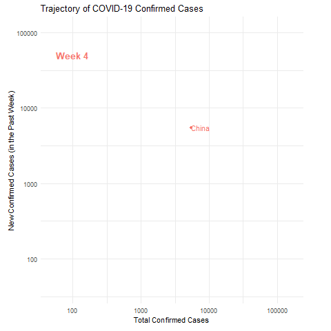

# Animated plots of Covid-19 trajectories

This repo contains code for reproducing the excellent [*Minute Physics* visualization of COVID-19 trajectories](https://www.youtube.com/watch?v=54XLXg4fYsc) using the [`gganimate` package](https://gganimate.com/).

This is my first attempt at using `gganimate` so the code could definitely be more elegant, but maybe this can serve as a starting point for people who want to use/include this type of visualization in a `Shiny` app or some other type of dashboard.

The code uses the neat new [`tidycovid19` package](https://github.com/joachim-gassen/tidycovid19) by [Joachim Gassen](https://github.com/joachim-gassen). I also recommend reading his blog post on [*Tidying the new Johns Hopkins Covid-19 time-series datasets*](https://joachim-gassen.github.io/2020/03/tidying-the-new-johns-hopkins-covid-19-datasests/).

The data used for the animated plots comes from the widely-known and -used [repository maintained by the Johns Hopkins University Center for Systems Science and Engineering (JHU CSSE)](https://github.com/CSSEGISandData/COVID-19).

I created two versions of the animated plots: One that closely resembles the visualization by *Minute Physics* in which the number of new confirmed cases for the last 7 days is plotted over the total number of confirmed cases (both on a log scale) and another one that is a slight variation of that, plotting the number of new cases per calendar week over the total number of confirmed cases (also both on a log scale).

### New cases in the last seven days

### New cases per calendar week
